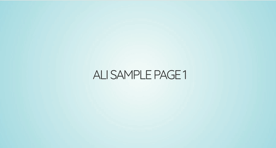

<div align="center">
  
</div>

Revealjs as Digital Signage (RDS) (beta testing)
=========

[](https://travis-ci.org/alivx/revealjs-digital-signage)

Free Digital Signage for Everyone. Start using this tool right now. `Revealjs as Digital Signage (RDS)` is an easy tool to create Digital Signage.
This tool use jinja2 template to render it to ready Revealjs html using python.




# config.yaml
Presentation behaviour can be fine-tuned using a wide array of configuration options

Example:
```Bash
htmlOutputFileName: index.html #Final output HTML file
combinedHTMLSlides: mergedHTML.html #Name of combined section
slidesPrefixPathnName: sections/slide*.html #Section html files path and prefix
templateFileName: mainTemplate.html #Main HTML template file
finalOutputDir: output #Output Dir name
transitions: zoom # none, fade, slide, convex, concave, zoom
autoPlayMedia: "true" #null, "true", "false"
hashOneBasedIndex: "true"
```

# generate.py
run command to render the template `python generate.py`

# static/Media
Store all media that you used inside the slides

# static/Files
Do not touch those file(revealjs files), if you do not know what you do :)

# sections
Put all your slide in HTML files

---

# How to use
[ascii play cast](https://asciinema.org/a/367581)

0. Create new venv by `python -m venv venv/`
1. Put your slide as HTML in `sections` Dir.
2. Put your media files in Media if exists.
3. change the config files if required.
4. run command `python generate.py`
5. the output file with name `index.html` will appear in the root Dir.

To control slide using cli:
run `cd signage;python main.py` in other terminal.
Next slide: run command `curl http://localhost:5000/next`
Prev slide: run command `curl http://localhost:5000/next`
Jump to slide: run command `curl http://localhost:5000/slide/slide_number`

## Using Docker to generate a new slides files from existing one.

```Bash
docker container run -ti  -p5000:5000  --net=host  alivx/ali:latest
Or for local edit
docker container run -ti -v $PWD:/app -p5000:5000  --net=host local:rds
```

Check the output Dir for final HTML files, you can find path under config['finalOutputDir']


# Serve html file using flask
under output file, run python serve.py

* check default URL http://localhost:5000
* you can change flask setting under `config.yaml`

# How to add new section(slide)
Markup hierarchy needs to be <div class="reveal"> <div class="slides"> <section> where the <section> represents one slide and can be repeated indefinitely. If you place multiple <section>'s inside of another <section> they will be shown as vertical slides. The first of the vertical slides is the "root" of the others (at the top), and it will be included in the horizontal sequence. For example:


```html
	<div class="reveal">
		<div class="slides">
      <!-- all content inside sections Dir will be included here automaticly -->
      
      <section>Another slide</section>
		</div>
	</div>
```

### Markdown
write your slides using Markdown. To enable Markdown, add the data-markdown attribute to your <section> elements and wrap the contents in a <script type="text/template"> like the example below.

```html
<section data-markdown>
	<script type="text/template">
  ## Blockquotes
  > Blockquotes can also be nested...
  >> ...by using additional greater-than signs right next to each other...
  > > > ...or with spaces between arrows.
  ## Lists
  Unordered

  + Create a list by starting a line with `+`, `-`, or `*`
  + Sub-lists are made by indenting 2 spaces:
    - Marker character change forces new list start:
      * Ac tristique libero volutpat at
      + Facilisis in pretium nisl aliquet
      - Nulla volutpat aliquam velit
  + Very easy!
	</script>
</section>
```


# Notes:

* you can use print option in the browser to print presentation slides as PDF file.

Author Information
------------------

The role was originally developed by [Ali Saleh Baker](https://www.linkedin.com/in/alivx/).
